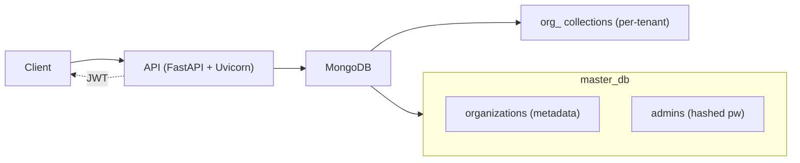
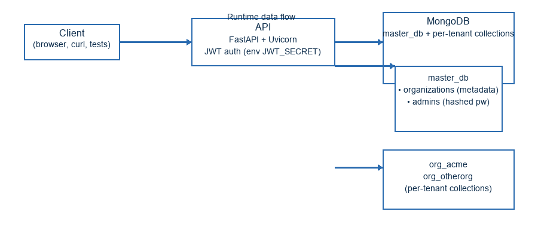

# Organization Management Service

This is a small FastAPI service that demonstrates a multi-tenant style organization management system using MongoDB.

Features implemented:
- Create organization (creates a dynamic collection named `org_<organization_name>`)
- Get organization details
- Update organization (rename org, update admin email/password, copies data to new collection)
- Delete organization (authenticated admin only)
- Admin login returning JWT token

Tech stack:
- FastAPI (async)
- Motor (async MongoDB driver)
- passlib (bcrypt) for password hashing
- python-jose for JWT

Running locally (using docker compose):

1. Start MongoDB via docker-compose (a `mongo` service is included in `docker-compose.yml`):

```powershell
docker-compose up -d
```

2. Install Python requirements (recommended to use a venv):

```powershell
python -m venv .venv; .\.venv\Scripts\Activate.ps1; python -m pip install -r requirements.txt
```

3. Run the FastAPI app:

```powershell
uvicorn app.main:app --reload --host 0.0.0.0 --port 8000
```

API endpoints:
- POST /org/create
- GET /org/get?organization_name=NAME
- PUT /org/update
- DELETE /org/delete?organization_name=NAME (requires Authorization: Bearer <token>)
- POST /admin/login

Notes & assumptions:
- When updating the organization name, the service copies all documents from the old collection to the new one and drops the old collection.
- Admin credentials are stored in the master DB (`master_db.admins`) with hashed passwords.
- JWT contains `sub` (admin id), `email`, and `organization_name`.
 - JWT contains `sub` (admin id), `org_id`, `email`, and `organization_name`.

Important security notes:
- The token is signed with the `JWT_SECRET` environment variable. For production, set `JWT_SECRET` to a strong random value and do not rely on the default `change-me-in-prod` value.
- To force the service to fail startup when a weak/default JWT secret is present, set environment variable `REQUIRE_JWT_SECRET=1`. This is optional and disabled by default for local development.
- bcrypt: passwords use bcrypt hashing. Bcrypt only uses the first 72 bytes of a password — the service rejects longer passwords with a clear error. Use reasonably long but not extremely long passphrases.

Design notes (short):
- Master DB holds organization metadata and admin credentials. Each organization's data lives in a collection prefixed with `org_`.
- This is simple and works well for small to medium workloads. For large scale, consider separate databases per tenant or dedicated clusters per tenant for isolation and sharding.
- Trade-offs and alternatives are discussed in the `DESIGN_NOTES.md`.

Architecture diagram
--------------------

A small diagram showing the main runtime pieces and where tenant data lives.

ASCII diagram:

```
Client (browser, curl, tests)
		 |
		 v
	API (FastAPI + Uvicorn)
		 |  (auth: JWT signed with $JWT_SECRET)
		 v
	MongoDB (single cluster)
		 |-- master_db
		 |     |-- organizations (metadata)
		 |     |-- admins (hashed passwords)
		 |
		 |-- org_<organization_name>  <-- per-organization collection(s)
		 |-- org_<other_organization>
```

Mermaid (optional, supported on some renderers):



Rendered image (PNG/SVG)
------------------------

If viewer doesn't render Mermaid, an embedded SVG diagram is available below:




Next steps / improvements:
- Add unit tests and CI config
- Add RBAC, refresh tokens, and better migration support for renames
- Add soft-delete and backups when deleting orgs
 - Run `ruff` for linting and follow style fixes before submitting.

Developer helper scripts
------------------------

This repository includes a few small developer helper scripts under `scripts/`.
The recommended canonical helpers are:

- `scripts/eval_check.py` — robust end-to-end verifier used during evaluation; preferred for CI and reviewers.
- `scripts/smoke_test.py` — lightweight manual smoke test (create → login → delete) for quick local checks.

Other simple one-off helpers were archived under `scripts/archived/` to reduce noise. If you need them, run the archived copies; for automated verification prefer `scripts/eval_check.py`.

CI
-- A simple GitHub Actions workflow is included at `.github/workflows/ci.yml` that installs dependencies, runs `ruff` and `pytest`, and builds the Docker image. In CI you should set `JWT_SECRET` to a secure value.
